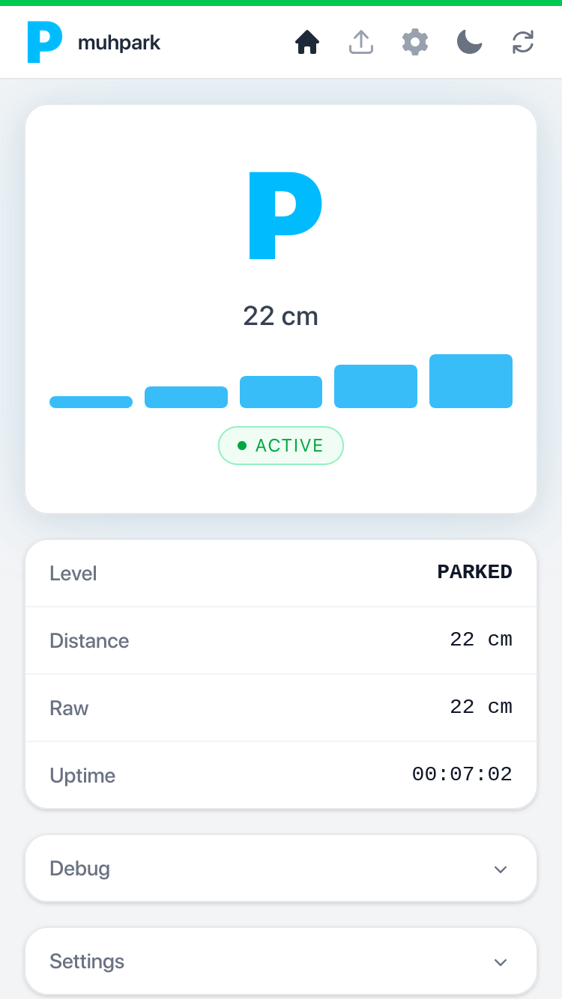

#  MuhPark

Smart parking sensor — ESP32-S2 Mini + VL53L1X + MAX7219 8×8 LED matrix.

<p align="center">
  
</p>

## Hardware

| Component | Part |
|---|---|
| MCU | LOLIN S2 Mini (ESP32-S2) |
| Sensor | VL53L1X time-of-flight (I2C) |
| Display | 8×8 LED matrix, MAX7219 driver |

## Variants

Two sensor configurations are supported, selected at build time.

### Variant A — single side-mounted sensor (default)

One VL53L1X mounted at the side of the parking spot, measuring approach distance. Shows levels 1–5 as the car approaches, and a smiley when parked (≤ 25 cm).

Build environment: `lolin_s2_mini`

### Variant B — dual ceiling-mounted sensors

Two VL53L1X sensors mounted on the ceiling pointing downward. When **both** sensors detect the car (reading below the configured threshold), the car is confirmed in place and a smiley is shown. No approach levels — purely binary presence detection.

Build environment: `ceiling_dual`

---

## Wiring

### MAX7219 (both variants)

```
MAX7219 VCC  →  ESP32 5V
MAX7219 GND  →  ESP32 GND
MAX7219 DIN  →  GPIO 7
MAX7219 CLK  →  GPIO 3
MAX7219 CS   →  GPIO 5
```

> **Note:** MAX7219 logic threshold is ~3.5 V. Driving directly from 3.3 V GPIO
> usually works; for guaranteed reliability add a 74AHCT125 level shifter on
> DIN and CLK.

### Variant A — single VL53L1X

```
VL53L1X VIN  →  ESP32 3.3 V
VL53L1X GND  →  ESP32 GND
VL53L1X SDA  →  GPIO 33
VL53L1X SCL  →  GPIO 35
```

No voltage divider needed — the sensor runs at 3.3 V natively.

### Variant B — dual VL53L1X

Both sensors share the I2C bus. One XSHUT pin is required to sequence address assignment on boot.

```
Sensor A VIN    →  ESP32 3.3 V       (address reassigned to 0x30)
Sensor A GND    →  ESP32 GND
Sensor A SDA    →  GPIO 33
Sensor A SCL    →  GPIO 35
Sensor A XSHUT  →  (no connection)

Sensor B VIN    →  ESP32 3.3 V       (keeps default address 0x29)
Sensor B GND    →  ESP32 GND
Sensor B SDA    →  GPIO 33
Sensor B SCL    →  GPIO 35
Sensor B XSHUT  →  GPIO 34
```

`PIN_XSHUT_B` is defined in `sensor.cpp` and can be changed to any free GPIO.

---

## Configuration

Credentials live in `pio_secrets.py` (gitignored). Copy `pio_secrets.py.example` if present, or set them as build flags directly:

```ini
build_flags =
    -DWIFI_SSID=\"MyNetwork\"
    -DWIFI_PASSWORD=\"MyPassword\"
```

If WiFi fails the device starts an AP named **muhpark-ap** (no password).
Connect and browse to `192.168.4.1`.

---

## Build & Flash

```bash
# Install PlatformIO CLI (skip if already installed)
pip install platformio

# Variant A (default)
pio run -e lolin_s2_mini -t upload
pio run -e lolin_s2_mini -t uploadfs   # first flash only

# Variant B (dual ceiling)
pio run -e ceiling_dual -t upload
pio run -e ceiling_dual -t uploadfs    # first flash only

# OTA
pio run -e ota -t upload               # Variant A over-the-air
pio run -e ceiling_dual_ota -t upload  # Variant B over-the-air

# Monitor serial
pio device monitor
```

Both `upload` and `uploadfs` are required on first flash. After that OTA can replace the firmware without USB.

---

## Display Logic

### Variant A

| Distance | Level shown |
|---|---|
| 200–300 cm | **5** |
| 150–200 cm | **4** |
| 100–150 cm | **3** |
| 50–100 cm  | **2** |
| 25–50 cm   | **1** |
| ≤ 25 cm    | smiley (parked) |
| > 300 cm   | off |

Each boundary has ~10% hysteresis to prevent flickering.

### Variant B

| Condition | Shown |
|---|---|
| Both sensors detect car (< `activate_dist`) | smiley |
| Either sensor sees open space | off |

Set `activate_dist` in the web UI to a value between your ceiling height and the car roof height (e.g. ceiling 220 cm, car 140 cm → use ~180 cm).

---

## State Machine

```
             object detected
  SLEEPING ────────────────► ACTIVE
     ▲                         │  ▲
     │  60 s timeout           │  │ object in range
     │                         ▼  │
   IDLE ◄──────────────────── object leaves
```

LED matrix is on only during **ACTIVE**. Both IDLE and SLEEPING keep it off.

---

## Web Interface

Open `http://<device-ip>` in any browser.

- Live distance and parking level over WebSocket
- State badge (ACTIVE / IDLE / SLEEPING)
- Progress bar for remaining distance
- Automatic reconnect with exponential back-off

REST fallback: `GET /api/status` returns JSON (useful for scripting).

---

## Architecture

```
loop()
  every ~100 ms (sensor dataReady):
    Sensor::update()       — read, filter, level/presence calc, state machine
    Display::update()      — show level pattern or smiley on MAX7219
    Web::notify()          — push JSON over WebSocket

  every 200 ms:
    Web::loop()            — WebSocket broadcast
    Mqtt::loop()           — MQTT reconnect / publish on change
```

---

## Adjusting Parameters

Key constants in `src/sensor.cpp`:

| Constant | Default | Purpose |
|---|---|---|
| `LEVEL_DEBOUNCE` | 5 | readings before a level change commits |
| `FILTER_SIZE` | 7 | median filter window (Variant A only) |
| `INNER_CLOSER[]` | see code | per-level activation thresholds, cm (Variant A only) |
| `INNER_FARTHER[]` | see code | per-level deactivation thresholds, cm (Variant A only) |
| `PIN_XSHUT_B` | GPIO 34 | XSHUT pin for sensor B (Variant B only) |

Runtime settings (web UI / `config.json`):

| Setting | Purpose |
|---|---|
| `activate_dist` | Approach trigger distance (Variant A) / ceiling presence threshold (Variant B) |
| `offset` | Distance calibration offset applied to all sensor readings |
| `sleep_timeout` | Seconds before display sleeps after last level change |
| `brightness` | LED matrix brightness (0–15) |
